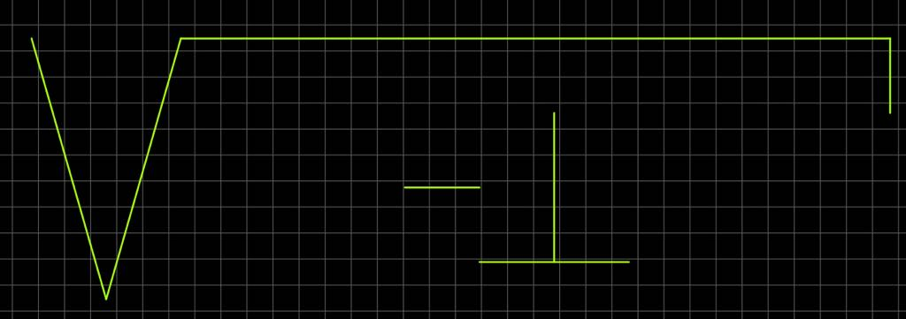
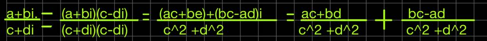

# CNYT
Ciencias Naturales y Tecnologia 

## Contenido
>
* Suma 
* Reta
* Multiplicación
* División
* Conjugado
* Modulo
* Conjugado
* Polar a cartesiano
* Cartesiano a polar
* Fase
* Suma vectorial
* Inverso vectorial
* Multiplicacion de vector por un escalar
* Suma Matriz
* Matriz Inversa
* Multiplicacion de matriz por un escalar
* Matriz Conjugada
* Vector Conjugado
* Matriz Transpuesta
* Vector Transpuesto
* Vector Adjunto
* Matriz Conjugada
* Producto Matriz
* Producto Vector
* Matriz Adjunta
* Matriz Normal
* Distancia Vector
* Matriz Unitaria
* Matriz Tensor
* Matriz Hermitiana
* Vector Tensor

## Suma 

_La **suma de números complejos** se realiza sumando partes reales entre sí y partes imaginarias entre sí._
> **( a + bi) + (c + di) = (a + c) + (b + d)i**

## Resta

_La **diferencia de números complejos** se realiza restando partes reales entre sí y partes imaginarias entre sí._
>**( a + b_i_) − (c + d_i_) = (a − c) + (b − d)_i_**

## Multiplicación

_El **producto de los números complejos** se realiza aplicando la propiedad **distributiva** del producto respecto de la suma y teniendo en cuenta que_          
> _**i**_^2  = −1.
> **(a + b_i_) · (c + d_i_) = (ac − bd) + (ad + bc)_i_**

## División 

_Para **dividir números complejos** en forma binómica se multiplica numerador y denominador por el conjugado del denominador y se realizan las operaciones correspondientes._

## Módulo
_Se llama **módulo** de un número complejo _z_ = (_a_,_b_) a la distancia del origen de coordenadas al afijo de dicho número. Quiere decir que el modulo de z es:_
**|M|=|a+bi|=(a^2+b^2)^(1/2)**

## Pruebas 

Para las pruebas se pudo probar distintas funciones del codigo que garantiza su correcta funcionalidad. Los metodos que se colocaron a prueba fueron:
> 
* Suma 
* Reta
* Multiplicación
* División
* Conjugado
* Modulo
* Conjugado
* polar a cartesiano
* cartesiano a polar
* fase
* suma vectorial
* inverso vectorial
* multiplicacion de vector por un escalar
* Matriz Conjugada
* Vector Conjugado
* Matriz Transpuesta
* Vector Transpuesto
* Vector Adjunto
* Matriz Conjugada
* Producto Matriz
* Producto Vector
* Matriz Adjunta
* Matriz Normal
* Distancia Vector
* Matriz Unitaria
* Matriz Tensor
* Matriz Hermitiana
* Vector Tensor

### Licencia
_Esta libreria es de uso **GRATUITO**_

### Para compilar las pruebas 
_El Archivo de las pruebas se llama pruebas.py debe estar en la misma carpeta de calculator.py._
### Uso de la calculadora
Si desea utilizar la calculadora debe seguir los siguientes pasos
~~~
* para Iniciar las pruebas debe iniciar el archivo que esta en la misma carpeta de la calculadora y debe de presionar f5 para corran las pruebas y ver si hay fallos o todas corren bine.
~~~
* _Calculadora_
* _Santiago Agustin Laiton Cubides_
* _saagulaicu@hotmail.com_

## Referencias Bibliograficas
*Quantum Computing for computer Scientists

